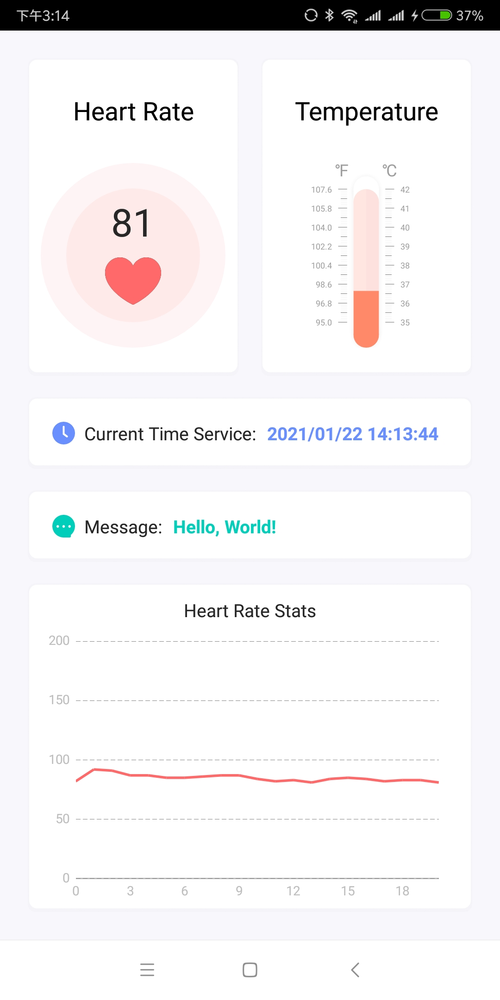

# BLE Peripheral Simulator

The BLE Peripheral Simulator is an Android APP that allows developers to try out new features of Cassia Gateway without the need for a BLE Peripheral Device.

### 1. APP Broadcast Instructions

#### 1.1 Identification
Name is `Cassia Demo App`, which is used to identify the device broadcast by the APP.

#### 1.2 Parameters
- LegacyMode, Connectable, Scannable, Interval(160ms), TxPowerLevel(1)
- The broadcast packet is updated every 0.5 second

#### 1.3 Services Data
|Data Type|Start Index|Type|Byte Order| Range| Example|
|--|--|--|--|--|--|
|Heart Rate|22|uint8|-|[50,140]|<ul><li>Hex: 51</li><li>Type Conversion: 0x51</li><li>Heart Rate: 81</li>|
|Temperature|29|uint16|Big Endian(MSB)|[35.00,40.00]|<ul><li>Hex: 0E7E</li><li>Type Conversion: 0x0E7E</li><li>Temperature: 37.1</li>|

* Example broadcast package: 0201020EFFFFFF1819958D293D00000000000416372A5D07161C2A00000E07
    * 1819958D293D: fixed mac, or uid, starts with 0x18, 0x19
    * 00000000000: reserved manufacturer data
    * 5D: heart rate, 93
    * 0E07: temperature, 0x0E07 / 100 = 35.91℃
* Example of Scan response package: 12094361737369612044656d6f20417070
    * 4361737369612044656d6f20417070: Cassia Demo App

### 2. APP Connect Instructions
A developer can use the APP to simulate a BLE Peripheral with one of these services:

|Service Name|UUID|
|--|--|
|Current Time|00002a2b-0000-1000-8000-00805f9b34fb|
|Heart Rate|00002a37-0000-1000-8000-00805f9b34fb|
|Health Thermometer|00002a1c-0000-1000-8000-00805f9b34fb|
|Alert Notification Service|00002a46-0000-1000-8000-00805f9b34fb|

#### 2.1 Current Time Service
* Service Reference: [Current Time](https://www.bluetooth.com/wp-content/uploads/Sitecore-Media-Library/Gatt/Xml/Services/org.bluetooth.service.current_time.xml)
* Characteristic Reference: [CurrentTime](https://www.bluetooth.com/wp-content/uploads/Sitecore-Media-Library/Gatt/Xml/Characteristics/org.bluetooth.characteristic.current_time.xml)
* Set current date time
    * Connect App
    * Write Command to UUID 00002a2b-0000-1000-8000-00805f9b34fb
    * Command:
        * Example:
            * e4070a0814060a000000, it means 2020/10/08 20:06:10
        * Fields:
            * e407: Occupies 2 byte, Little endian, Year, 0x07e4 -> 2020
            * 0a: Occupies 1 byte, Month, 0x0a -> 10, October
            * 08: Occupies 1 byte, Day, 0x08 -> 08, Day 08
            * 14: Occupies 1 byte, Hour, 0x14 -> 20, 20 Hour
            * 06: Occupies 1 byte, Minute, 0x06 -> 06, 06 Minute
            * 0a: Occupies 1 byte, Second, 0x0a -> 10, 10 Second
            * 00: Occupies 1 byte, Day of Week, APP not yet supported
            * 00: Occupies 1 byte, Fractions256, APP not yet supported
            * 00: Occupies 1 byte, Adjust Reason, APP not yet supported
* Read current date time
    * Connect App
    * Read from UUID 00002a2b-0000-1000-8000-00805f9b34fb
    * Fields: As mentioned above       

#### 2.2 Heart Rate Service
* Service Reference: [Heart Rate](https://www.bluetooth.com/wp-content/uploads/Sitecore-Media-Library/Gatt/Xml/Services/org.bluetooth.service.heart_rate.xml)
* Characteristic Reference: [Heart Rate Measurement](https://www.bluetooth.com/wp-content/uploads/Sitecore-Media-Library/Gatt/Xml/Characteristics/org.bluetooth.characteristic.heart_rate_measurement.xml)
    * UUID: 00002a37-0000-1000-8000-00805f9b34fb
* Support notify report data:
    * Connect App
    * Open Notify: UUID 00002902-0000-1000-8000-00805f9b34fb
        * Open: Write 0100
        * Close: Write 0000
    * The notify data is updated every 0.5 second and is a random number between 80 and 120
    * Example: 
        * 08580000: 0x58, Occupies 1 byte, Heart Rate 88

#### 2.3 Health Thermometer
* Service Reference: [Health Thermometer](https://www.bluetooth.com/wp-content/uploads/Sitecore-Media-Library/Gatt/Xml/Services/org.bluetooth.service.health_thermometer.xml)
* Characteristic Reference: [Temperature Measurement](https://www.bluetooth.com/wp-content/uploads/Sitecore-Media-Library/Gatt/Xml/Characteristics/org.bluetooth.characteristic.temperature_measurement.xml)
* Support indicate data:
    * Connect App
    * Open Indicate: UUID 00002902-0000-1000-8000-00805f9b34fb
        * Open: Write 0200
        * Close: Write 0000
    * The notify data is updated every 0.5 second and is a random number between 35.00 and 40.00
    * Example:
        * 00420E00FE: 0x0E42, Occupies 2 byte, Little endian, Temperature 36.50℃

#### 2.4 Alert Notification Service
* Service Reference: [Alert Notification](https://www.bluetooth.com/wp-content/uploads/Sitecore-Media-Library/Gatt/Xml/Services/org.bluetooth.service.alert_notification.xml)
* Characteristic Reference: [New Alert](https://www.bluetooth.com/wp-content/uploads/Sitecore-Media-Library/Gatt/Xml/Characteristics/org.bluetooth.characteristic.new_alert.xml)
* Send BLE Message:
    * Connect App
    * Write command to characteristic UUID 00002a46-0000-1000-8000-00805f9b34fb
    * Command:
        * Example:
            * 050148656c6c6f2c20576f726c6421, it means "Hello, World!"
        * Fields:
            * 05: Occupies 1 byte, categoryId, APP not yet supported
            * 01: Occupies 1 byte, Number Of New Alert, APP not yet supported
            * 48656c6c6f2c20576f726c6421: Occupies N bytes, utfs, "Hello, World!"
    * Support notify report data:
            * Connect App
            * Open Notify: UUID 00002902-0000-1000-8000-00805f9b34fb
                * Open: Write 0100
                * Close: Write 0000
            * The notify data is updated when APP received BLE message
            * Fields and Example: As mentioned above

The developer can use the Cassia Gateway features to connect to the APP to Read and Write Characteristics, Subscribe to Notifications for when the Characteristics change, and Read and Write Descriptors.

From the APP a developer can set the characteristics' values, send notifications and disconnect.

### 3. Caveats
* Please keep the App front when using.
* Please close the APP in time when not in use to prevent the battery from draining quickly.
* BLE broadcast uses API level 26, and currently only supports Android 8 or higher versions.
* Due to hardware chipset dependency, some devices don't have access to this feature. Reference: http://stackoverflow.com/questions/26482611/chipsets-devices-supporting-android-5-ble-peripheral-mode.

### 4. Todo List
* App add gatt auth
* App add LED service
* App add stopping-advertising switch
* App add temperature display
* App add version display
* App disconnect function
* Adapt to lower version android
